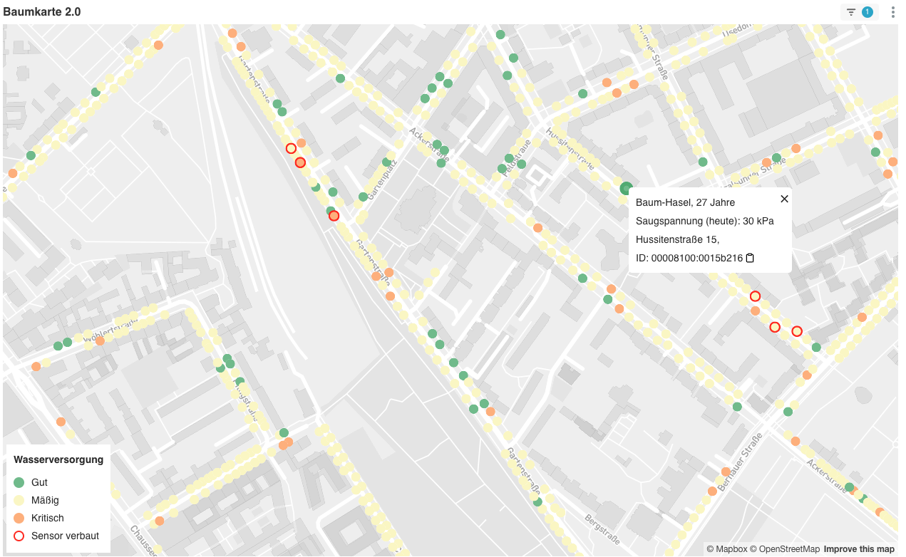

# Superset for QTrees

This is a fork of [Superset](https://github.com/apache/superset), customized to fit the use cases of the [QTrees](https://qtrees.ai/) project.

## Customization

- Custom plugin to visualize tree points on a Deck.gl / Mapbox based map. Source code in [./superset-frontend/plugins/superset-plugin-trees-map](./superset-frontend/plugins/superset-plugin-trees-map).
  
  Documentation on how to develop a custom plugin can be found here:
  - https://preset.io/blog/building-custom-viz-plugins-in-superset-v2/
  - https://superset.apache.org/docs/contributing/creating-viz-plugins/
  - https://medium.com/nmc-techblog/apache-superset-manage-custom-viz-plugins-in-production-9fde1a708e55
  - https://github.com/nielsen-oss/superset-viz-plugins/blob/master/README.md
- Refer to the initial pull request to see which changes needed to be done to have a custom plugin: https://github.com/technologiestiftung/superset-qtrees/pull/2
- Configuration in [./superset/config.py](./superset/config.py)
  - Row limits:
    ```
    # default row limit when requesting chart data
    ROW_LIMIT = 100000
    # default row limit when requesting samples from datasource in explore view
    SAMPLES_ROW_LIMIT = 1000
    # default row limit for native filters
    NATIVE_FILTER_DEFAULT_ROW_LIMIT = 1000
    # max rows retrieved by filter select auto complete
    FILTER_SELECT_ROW_LIMIT = 100000
    ```
  - Enabled feature flags: `ENABLE_JAVASCRIPT_CONTROLS`, `ALERT_REPORTS`, `DASHBOARD_RBAC`
  - Talisman / CSP:
    ```
    TALISMAN_CONFIG = {
    "content_security_policy": {
        "default-src": ["'self'"],
        "img-src": ["'self'", "data:", "https://*.qtrees.ai", "https://logos.citylab-berlin.org", "https://www.gravatar.com"],
        "worker-src": ["'self'", "blob:"],
        "connect-src": [
            "'self'",
            "https://api.mapbox.com",
            "https://events.mapbox.com",
        ],
        "object-src": "'none'",
        "style-src": ["'self'", "'unsafe-inline'", "https://api.tiles.mapbox.com"],
        "script-src": ["'self'", "'strict-dynamic'", "'unsafe-eval'", "'unsafe-inline'"],
    },
    "content_security_policy_nonce_in": ["script-src"],
    "force_https": False,
    }
    ```
- Matomo Tracking in [./superset/templates/tail_js_custom_extra.html](tail_js_custom_extra.html):
  ```
  <!-- Matomo -->
  <script>
    var _paq = (window._paq = window._paq || []);
    /* tracker methods like "setCustomDimension" should be called before "trackPageView" */
    _paq.push(["trackPageView"]);
    _paq.push(["enableLinkTracking"]);
    (function () {
      var u = "https://piwik.technologiestiftung-berlin.de/";
      _paq.push(["setTrackerUrl", u + "matomo.php"]);
      _paq.push(["setSiteId", "33"]);
      var d = document,
        g = d.createElement("script"),
        s = d.getElementsByTagName("script")[0];
      g.async = true;
      g.src = u + "matomo.js";
      s.parentNode.insertBefore(g, s);
    })();
  </script>
  <!-- End Matomo Code -->
  ```

## Dataset preparation in Superset

In order to use this plugin, you need a dataset with the following columns:

```
id STRING
standortnr STRING
lat FLOAT
lng FLOAT
art_dtsch STRING
standalter FLOAT
strname STRING
hausnr STRING
nowcast_value INTEGER
nowcast_timestamp DATETIMETZ
has_actual_sensor BOOLEAN
```

For QTrees, we create this dataset via a Virtual SQL query:

```
SELECT
  trees.id,
  trees.bezirk,
  trees.kennzeich,
  trees.standortnr,
  trees.lat, trees.lng,
  trees.art_dtsch, trees.standalter,
  trees.strname, trees.hausnr, trees.baumhoehe, trees.stammumfg,
  trees.art_bot,
  trees.street_tree,
  CAST(value as int) as nowcast_value,
  type_id as nowcast_type_id,
  timestamp as nowcast_timestamp,
  CASE type_id
    WHEN 1 THEN 30
    WHEN 2 THEN 60
    WHEN 3 THEN 90
    ELSE type_id
  END AS converted_type,
EXISTS (SELECT * FROM private.tree_devices where tree_devices.tree_id = trees.id) as has_actual_sensor
FROM public.trees
LEFT JOIN public.nowcast
   ON trees.id = nowcast.tree_id
WHERE nowcast.type_id = 4 AND (bezirk = 'Mitte' OR bezirk = 'Neukölln')
```

## Building the Docker image

The Docker image is built as described in the Github Action [./github/workflows/build-docker-image.yml](./github/workflows/build-docker-image.yml):

- on pull request to `master`: Build the Docker image (but do not push)
- on `v.*.*.*` tag push: Build the Docker image and push to the [Technologiestiftung Dockerhub](https://hub.docker.com/r/technologiestiftung/superset-qtrees)

## Deployment

This instance of Superset is deployed on a private [Portainer](https://www.portainer.io/) instance at https://prtnr.arnold.citylab-berlin.org/. The corresponding docker-compose configuration is located in the private Github repository: https://github.com/technologiestiftung/my-little-root-servers/blob/main/arnold/.

- Production stack: `superset_qtrees` corresponds to https://github.com/technologiestiftung/my-little-root-servers/blob/main/arnold/superset_qtrees/docker-compose.yml
- Staging / development stack: `superset_qtrees_dev` corresponds to https://github.com/technologiestiftung/my-little-root-servers/blob/main/arnold/superset_qtrees_dev/docker-compose.yml

Deployment steps:

- Build new Docker image (in this repository) by tagging a specific commit
- Wait for the Github Action to finish, the Docker image will be on Dockerhub: https://hub.docker.com/r/technologiestiftung/superset-qtrees
- Reference the new Docker image in the docker-compose files of the environment you want to change: https://github.com/technologiestiftung/my-little-root-servers/blob/main/arnold/
- "Pull & Redeploy" in https://prtnr.arnold.citylab-berlin.org/
